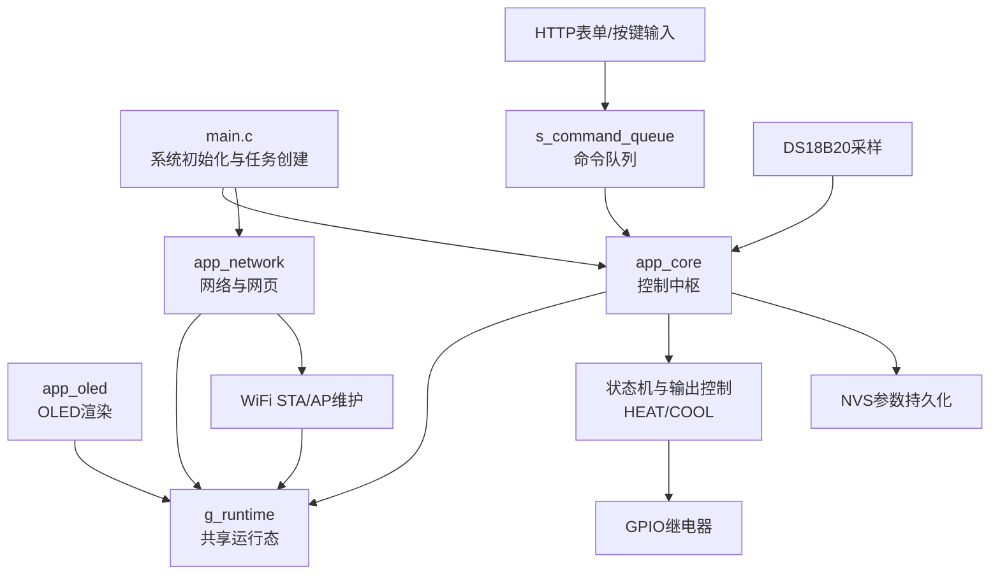
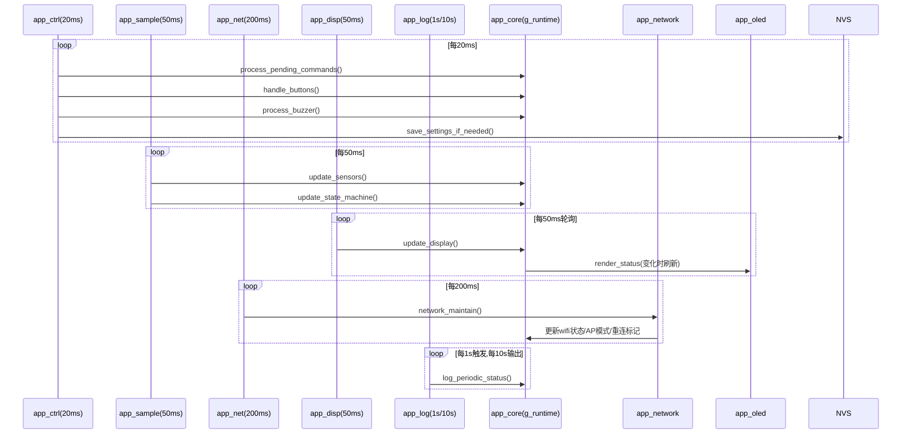
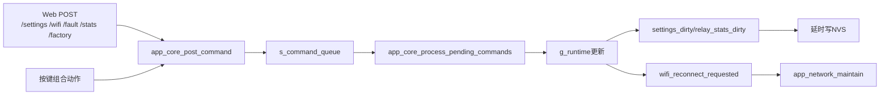

# 软件架构设计（ESP-IDF）

## 1. 设计目标

- 实现 100L 鱼缸温度控制器的稳定温控（加热/制冷互锁、保护时序、故障锁定）。
- 提供本地按键与网页双入口控制，保证人机交互一致性。
- 在资源受限设备上保持任务职责单一、调度可预测、故障可观测。
- 通过 NVS 持久化关键参数，支持掉电恢复与恢复出厂。

## 2. 总体架构

软件采用“共享运行态 + 多任务协作 + 命令队列解耦”的结构。

### 2.1 分层

1. 平台与系统层
- FreeRTOS 多任务调度
- ESP-IDF 组件（WiFi、HTTP Server、NVS、I2C、GPIO、日志）

2. 业务核心层（app_core）
- 传感采样与有效性判定
- 温控状态机与输出控制
- 按键行为与维护动作
- 运行态管理与持久化

3. 交互与网络层（app_network + app_oled）
- Web 页面与 JSON 接口
- WiFi STA/AP 自动切换与重连
- OLED 状态可视化

4. 入口层（main）
- 系统初始化
- 各任务创建与优先级配置

### 2.2 关键共享对象

- `g_runtime`：全局运行态（温度、状态、故障、网络、统计、按键过程变量）。
- `s_runtime_lock`：运行态互斥锁，保护并发读写。
- `s_command_queue`：命令队列，承载 Web/内部命令到控制核心。

## 3. 模块职责

### 3.1 main.c（系统编排）

- 初始化 NVS。
- 可选打印硬件生效配置（Flash/PSRAM/分区，受 `CONFIG_DEBUG_FLASH_PSRAM_ENABLE` 控制）。
- 初始化核心模块与网络模块。
- 创建 5 个业务任务并进入调度。

### 3.2 app_core.c（控制中枢）

- 参数管理：加载/延迟保存（NVS）。
- 命令处理：消费队列命令并执行（更新参数、清故障、清统计、恢复出厂）。
- 采样处理：双 DS18B20 数据读取、滤波、跳变检测、有效性管理。
- 状态机：根据温度与告警决定 `IDLE/HEATING/COOLING/DEGRADED/ALARM/FAULT_STOP`。
- 输出控制：继电器互斥、压缩机保护、最小启停时长控制。
- 按键处理：短按、长按、组合键维护动作。
- 显示与日志：OLED 刷新和周期状态日志。

### 3.3 app_network.c（网络与网页）

- 初始化 netif、event loop、WiFi、HTTP Server。
- 提供页面与接口：
  - `GET /`、`GET /status`
  - `POST /settings/control`
  - `POST /settings/wifi`
  - `POST /faults/reset`
  - `POST /stats/reset`
  - `POST /factory/reset`
- WiFi 维护策略：
  - STA 连接超时切 AP
  - AP 空闲后重试 STA
  - 参数变更后延迟重连

### 3.4 app_oled.c（显示驱动）

- I2C OLED 初始化（SH1106/SSD1306 兼容命令路径）。
- 双态显示：
  - 常态极简页：大温度 + 设定 + 模式/输出
  - 故障详情页：大温度 + 故障 + 探头明细 + 设定
- 差分刷新：页级比较，减少无效刷屏。

## 4. 任务设计

### 4.1 任务列表

| 任务名 | 函数 | 优先级 | 周期 | 主要职责 |
|---|---|---:|---:|---|
| app_sample | `app_sampling_task` | 8 | 50ms | 传感采样、状态机更新 |
| app_ctrl | `app_control_task` | 7 | 20ms | 命令消费、按键处理、蜂鸣器、参数保存 |
| app_net | `app_network_task` | 6 | 200ms | WiFi 维护与重连策略 |
| app_disp | `app_display_task` | 5 | 50ms 轮询 | OLED 更新（内部 66ms 节流） |
| app_log | `app_log_task` | 4 | 1000ms 轮询 | 周期日志（内部 10s 节流） |

说明：当前任务通过 `xTaskCreate` 创建，未绑定核心，运行核由 SMP 调度器动态分配。

### 4.2 各任务详细说明

1. app_sample
- 先调用 `app_core_update_sensors()`，再在锁内执行 `app_core_update_state_machine()`。
- 使用 `vTaskDelayUntil` 保证固定节拍，承担温控主时钟。

2. app_ctrl
- 单循环内依次执行：
  - `app_core_process_pending_commands()`
  - `app_core_handle_buttons()`
  - `app_core_process_buzzer()`
  - `app_save_settings_if_needed()`
- 是“外部命令落地”的统一执行点。

3. app_net
- 调用 `app_network_maintain()`：
  - 处理连接超时、AP 回退、重连触发条件。
- 与 WiFi/IP 事件回调协同更新网络状态。

4. app_disp
- 调用 `app_core_update_display()`。
- 通过快照比较与刷新节流减少 I2C 带宽占用。

5. app_log
- 调用 `app_core_log_periodic_status()`。
- 输出状态、温度、网络、采样周期等诊断信息。

## 5. 调度与并发模型

### 5.1 调度原则

- 采样与控制优先（8/7）高于网络、显示、日志（6/5/4）。
- 高频任务（20ms/50ms）用于控制闭环，低频任务用于观测与维护。
- 任务内部均为短事务 + 延时让出 CPU，避免长时间占用。

### 5.2 并发控制

- 共享状态统一通过 `app_core_lock()`/`app_core_unlock()` 保护。
- 网络事件回调、网络维护任务、显示任务、控制任务都可能访问 `g_runtime`。
- 命令通过队列进入核心，降低 Web 线程与控制逻辑直接耦合。

### 5.3 命令流

`Web/按键输入 -> 构造 app_command_t -> app_core_post_command -> app_ctrl 消费队列 -> 更新 g_runtime/触发保存/重连`

## 6. 控制状态机设计要点

1. 安全优先
- 高温/低温绝对阈值触发锁存故障。
- 双探头都失效进入 `FAULT_STOP`。

2. 退化与告警
- 单探头失效进入 `DEGRADED`（可退化运行）。
- 传感器温差过大或网络异常进入 `ALARM`。

3. 输出保护
- 加热/制冷互斥。
- 制冷最小关断时间（压缩机保护）。
- 加热/制冷最小开启时间约束。
- 上电抑制窗口内禁止输出。

## 7. 参数与持久化

### 7.1 持久化内容

- 控制参数：`setpoint`、`hysteresis`、`sensor_diff_alarm`、`buzzer_en`
- WiFi 参数：`wifi_ssid`、`wifi_pwd`
- 继电器统计：`heat_sw`、`cool_sw`

### 7.2 保存策略

- 设置变化后延时保存（`APP_SETTINGS_SAVE_DELAY_MS`）。
- 统计变化后延时保存（`APP_RELAY_STATS_SAVE_DELAY_MS`）。
- 降低频繁写 NVS 的磨损与阻塞风险。

### 7.3 恢复出厂

- 擦除业务命名空间数据并提交。
- 运行态恢复默认值，统计清零。
- 触发网络重连流程（可回 AP 入口）。

## 8. 网络与人机交互设计

1. 页面策略
- 首页简洁展示核心状态与快速设置。
- 高级项（WiFi/维护动作）放入折叠区域。

2. 交互方式
- 表单走 Ajax，操作后即时刷新状态。
- WiFi 保存/恢复出厂后进入重连监控提示。

3. 故障文案
- 网页优先显示中文故障描述，提升可读性。

## 9. 关键时序参数（当前）

- 采样周期：50ms
- 按键扫描：20ms
- 显示刷新节流：66ms
- 网络维护轮询：200ms
- 状态日志周期：10s
- WiFi 连接超时：12s
- WiFi 重连重试间隔：15s

## 10. 已知设计取舍与优化方向

1. 取舍
- 单一全局锁实现简单，但高并发下可能出现锁等待。
- 网络状态也走同一运行态锁，利于一致性但会增加争用点。

2. 可优化方向
- 将 `g_runtime` 拆分为“控制域/网络域”细粒度锁。
- 对高频路径增加执行耗时与锁等待统计。
- 依据观测结果考虑任务绑核（控制链与网络链分核）。
- 若真实传感器启用，进一步验证 50ms 周期与转换时长匹配。

## 11. 代码定位（便于追踪）

- 任务创建与入口：`firmware/esp32_idf/main/main.c`
- 控制核心：`firmware/esp32_idf/main/app_core.c`
- 网络与网页：`firmware/esp32_idf/main/app_network.c`
- OLED 显示：`firmware/esp32_idf/main/app_oled.c`
- 运行态定义：`firmware/esp32_idf/main/app_state.h`
- 参数配置：`firmware/esp32_idf/main/app_config.h`

## 12. 架构图（Mermaid）

## 13. 任务时序图（Mermaid）

## 14. 命令流图（Mermaid）

## 15. 任务绑定建议（可选）

在不改变业务逻辑前提下，可考虑以下绑核方案降低抖动：

- CPU1：`app_sample`、`app_ctrl`（控制闭环优先）
- CPU0：`app_net`、`app_disp`、`app_log`（网络与观测）

说明：当前工程未绑核，保持 SMP 动态分配。如需切换，可将 `xTaskCreate` 改为 `xTaskCreatePinnedToCore` 并做一轮实测。
