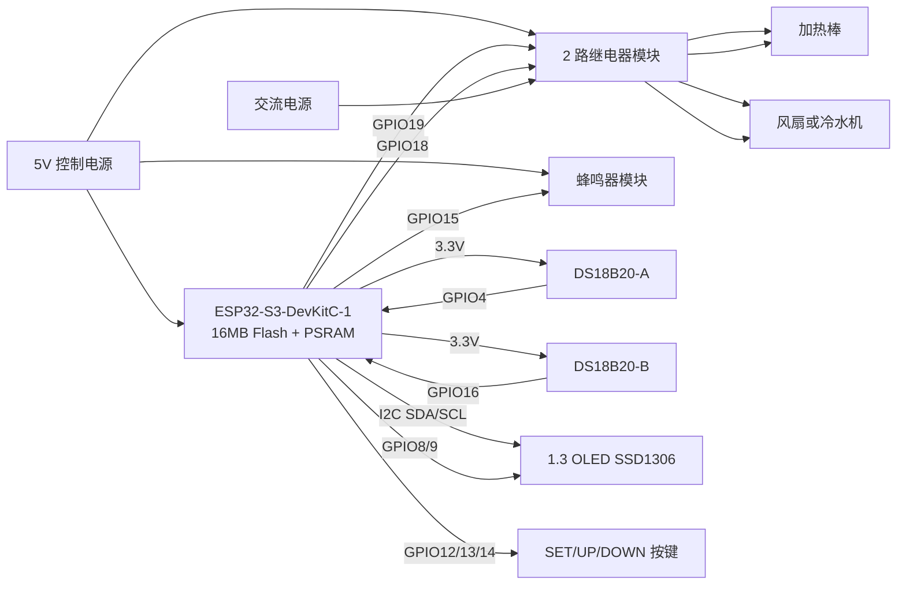

# 100L 鱼缸温度控制器系统连接图

## 说明

- 该图用于快速查看模块连接关系。
- 详细电气连接以 [原理图设计.md](%E5%8E%9F%E7%90%86%E5%9B%BE%E8%AE%BE%E8%AE%A1.md) 和 [接线总表.md](%E6%8E%A5%E7%BA%BF%E6%80%BB%E8%A1%A8.md) 为准。
- 第一版默认加热和制冷都采用继电器控制。
- 当前固件默认目标平台为 ESP32-S3-DevKitC-1，I2C OLED 与按键引脚已按 S3 版本固定。
